# Kubernetes Study Notes

## Day 1: Kubernetes Cluster Architecture

### Cluster layout

- **Control plane**: etcd, API server, scheduler, controller manager
- **Node A / Node B** (worker nodes): each runs a container runtime, kubelet, kube-proxy, and pods

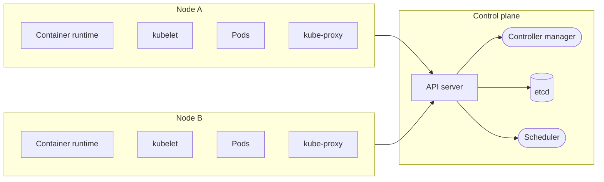


### Control plane responsibilities

- Receive user requests
- Store cluster state
- Decide where applications should start
- Detect differences between current and desired state
- Coordinate changes across the cluster

### Control plane components

**1. API server**
- Central communication hub. Interactions with the K8s cluster must go through the API server. Internal control plane components communicate with each other through the API server, not directly.
- Authentication and authorization. It validates the identity of the requester.

**2. etcd (key-value database)**
- Everything in the cluster, including secrets, pods, configurations, and cluster state, is stored inside etcd.
- Cluster state storage.

**3. Controller manager**
- Monitors the cluster's actual state by querying the K8s API server.
- Compares the actual state to the user-defined state (specified in the YAML manifest).
- If there is a difference, executes corrective actions to align the actual state with the desired state.

**4. Scheduler**
- Assigns newly created pods to valid worker nodes.
- Chooses a node for the new pod according to a set of rules.

### Worker node components

**1. kubelet**
- Agent (process) running on every node.
- Communicates with the API server on the control plane.
- Receives pod specifications.
- Communicates with the container runtime to start the container.
- Reports node and pod status to the API server.

**2. Container runtime (containerd)**
- Pulls container images.
- Creates containers.
- Starts and stops containers.

**3. kube-proxy**
- Enables networking between services.
- Allows traffic to reach the correct pods by configuring network rules.

**4. Pod**
- Smallest deployable unit in Kubernetes.
- A pod can hold one or more containers.

### Scenario: what happens on `kubectl apply`

1. The user runs `kubectl apply`.
2. kubectl sends the request to the API server.
3. The API server validates the request.
4. The desired state is stored in etcd.
5. The controller manager detects that a new pod must be created.
6. The scheduler chooses worker nodes for the pods.
7. The kubelet on each selected node receives the pod specifications.
8. The container runtime (containerd) pulls the images and runs the containers.
9. The kubelet reports the current status to the API server, and it is written to etcd.
10. The controller manager continuously monitors the application.

```
User/kubectl ──> API Server ──> etcd ──> Controller Manager ──> Scheduler ──> Kubelet ──> Container Runtime (Pod)
```

### In case of failure (a pod crashed)

- The kubelet reports the failure to the API server.
- The API server stores the report in etcd.
- The controller manager detects a conflict between current state and desired state.
- The controller creates a replacement.
- The scheduler assigns the new pod to a node.
- The kubelet starts the new pod.

---

## Day 2: Running Kubernetes Locally Using kind

- Nodes are Docker containers (kind control plane, kind node 1, kind node 2 each run as a container).

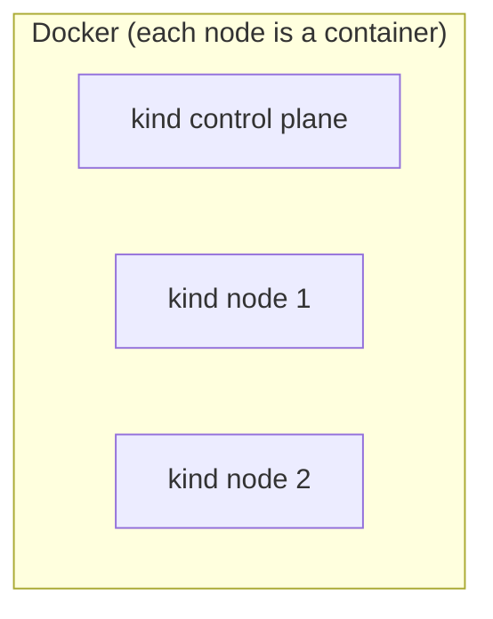


### Tools needed

- `kubectl` to interact with the API server
- `kind` to create the cluster
- `docker` to run the cluster nodes

### Basic commands

```bash
# create a single node cluster containing the worker node and the control plane
kind create cluster

# list the names of all local Kubernetes clusters currently running via kind
kind get clusters

# verify connection between kubectl and the kind cluster
kubectl cluster-info

# list all the worker nodes and control-plane nodes
kubectl get nodes

# list all the pods in your cluster
kubectl get pods -A

# delete cluster
kind delete cluster

# create a configured multi-node cluster (cluster.yaml)
kind create cluster --config cluster.yaml
```

---

## Day 3: Kubernetes Pods

A pod consists of one or more containers, and shares these across them:

- Network
- Storage
- Configuration
- Lifecycle

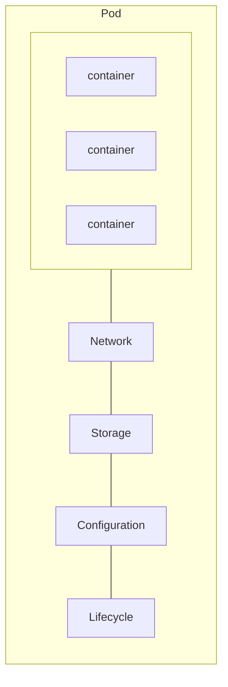


### Pod commands

```bash
# create a pod with nginx image
kubectl run nginx-pod --image=nginx
# pod/nginx-pod created

# list all the pods in the cluster
kubectl get pods
# NAME        READY   STATUS              RESTARTS   AGE
# nginx-pod   1/1     ContainerCreating   0          14s

# -o wide shows which worker node the pod lives on
kubectl get pods -o wide
# NAME        READY   STATUS    RESTARTS   AGE     IP           NODE                        NOMINATED NODE   READINESS GATES
# nginx-pod   1/1     Running   0          3m15s   10.244.1.2   multi-node-cluster-worker   <none>           <none>

# print a detailed snapshot of the pod's configuration, status, and lifecycle events
kubectl describe pod nginx-pod

# delete pod
kubectl delete pod nginx-pod

# create a pod using a configuration file (nginx-pod.yaml)
kubectl apply -f nginx-pod.yaml

# --show-labels displays the labels attached to the pods
kubectl get pods --show-labels
# NAME        READY   STATUS    RESTARTS   AGE   LABELS
# nginx-pod   1/1     Running   0          54s   app=nginx

# access a pod
kubectl exec -it nginx-pod -- bash

# access the logs of a container inside a pod
kubectl logs nginx-pod
```

### Pod lifecycle

#### Pod phase

| Phase | Meaning |
|---|---|
| **Pending** | The pod has been accepted but isn't running yet, e.g. still scheduling or the image is still downloading. |
| **Running** | The pod is bound to a node and at least one of its containers is running. |
| **Succeeded** | All containers terminated successfully with exit code 0 and will not be restarted (e.g. a job that runs for a minute and finishes). |
| **Failed** | The pod ended with an error, i.e. a non-zero exit code. |
| **Unknown** | The cluster can't obtain the pod's status, usually due to communication loss between the control plane and the node. |

#### Container state

| State | Meaning |
|---|---|
| **Waiting** | Default initial state; the container is still performing required startup operations, e.g. pulling the image from the registry, configuring network namespaces, applying secrets. |
| **Running** | The container is executing without issues. |
| **Terminated** | The main process inside the container has finished running, whether it succeeded or failed. |

---

## Day 4: Deployment, ReplicaSet

```
Deployment -> ReplicaSet -> Pods
```

### Why not bare pods?

- Pods are isolated. If we create a pod by itself and the node it runs on fails, the pod dies and is never brought back.
- No self-healing
- No scaling
- No zero-downtime updates
- Instead, we work with a **Deployment** to manage ReplicaSets that automatically handle scaling, updates, and recovery.

### ReplicaSet

Keeps the **current state** matching the **desired state**. For example, desired state = 3 replicas of the same application, current state = 2 replicas, so the ReplicaSet creates one more.

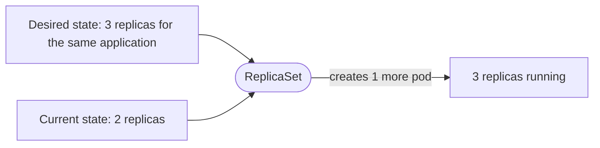


```bash
kubectl apply -f replicaset/replicaset.yaml
# replicaset.apps/nginx-replicaset created

kubectl get replicaset
# NAME               DESIRED   CURRENT   READY   AGE
# nginx-replicaset   3         3         3       70s

kubectl get pods
# NAME                     READY   STATUS    RESTARTS   AGE
# nginx-replicaset-9jhrn   1/1     Running   0          113s
# nginx-replicaset-jlh4f   1/1     Running   0          113s
# nginx-replicaset-vn2bs   1/1     Running   0          113s

kubectl get pods --show-labels
# NAME                     READY   STATUS    RESTARTS   AGE     LABELS
# nginx-replicaset-9jhrn   1/1     Running   0          2m41s   app=nginx
# nginx-replicaset-jlh4f   1/1     Running   0          2m41s   app=nginx
# nginx-replicaset-vn2bs   1/1     Running   0          2m41s   app=nginx

# delete a pod: the ReplicaSet immediately creates a replacement
kubectl delete pod nginx-replicaset-9jhrn
# pod "nginx-replicaset-9jhrn" deleted from default namespace

kubectl get pods --show-labels
# NAME                     READY   STATUS    RESTARTS   AGE     LABELS
# nginx-replicaset-2bb9h   1/1     Running   0          3s      app=nginx
# nginx-replicaset-jlh4f   1/1     Running   0          3m19s   app=nginx
# nginx-replicaset-vn2bs   1/1     Running   0          3m19s   app=nginx

# scale the ReplicaSet
kubectl scale replicaset nginx-replicaset --replicas=5
# replicaset.apps/nginx-replicaset scaled

kubectl get pods --show-labels
# NAME                     READY   STATUS    RESTARTS   AGE     LABELS
# nginx-replicaset-2bb9h   1/1     Running   0          73s     app=nginx
# nginx-replicaset-6678r   1/1     Running   0          5s      app=nginx
# nginx-replicaset-jlh4f   1/1     Running   0          4m29s   app=nginx
# nginx-replicaset-vn2bs   1/1     Running   0          4m29s   app=nginx
# nginx-replicaset-zjvpd   1/1     Running   0          5s      app=nginx
```

### Deployment

Used for production applications. Provides:

- Rolling updates
- Version changes
- Rollback
- Rollout history

A Deployment manages ReplicaSets: ReplicaSet (v1) pods and ReplicaSet (v2) pods.

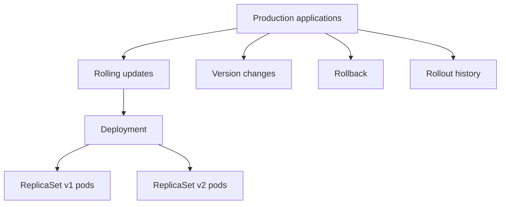


```bash
kubectl apply -f deployment/deployment.yaml
# deployment.apps/nginx-deployment created

kubectl get deployments
# NAME               READY   UP-TO-DATE   AVAILABLE   AGE
# nginx-deployment   3/3     3            3           53s

kubectl get replicasets
# NAME                          DESIRED   CURRENT   READY   AGE
# nginx-deployment-75b5f4565d   3         3         3       97s

kubectl get pods
# NAME                                READY   STATUS    RESTARTS   AGE
# nginx-deployment-75b5f4565d-65knj   1/1     Running   0          2m19s
# nginx-deployment-75b5f4565d-8pxhh   1/1     Running   0          2m19s
# nginx-deployment-75b5f4565d-bcjh2   1/1     Running   0          2m19s

# describe the deployment
kubectl describe deployments nginx-deployment

# scale up the number of pods
kubectl scale deployment nginx-deployment --replicas=5
# deployment.apps/nginx-deployment scaled
```

If you change the deployment configuration and apply it, kubectl creates a new ReplicaSet for the new version. Once it reaches the desired state, ReplicaSet v1 is scaled down to 0.

```bash
kubectl rollout status deployment/nginx-deployment
# deployment "nginx-deployment" successfully rolled out

# notice the old ReplicaSet is not deleted
kubectl get replicasets
# NAME                          DESIRED   CURRENT   READY   AGE
# nginx-deployment-75b5f4565d   0         0         0       10m
# nginx-deployment-c4f69f5d4    3         3         3       5m1s

# output the deployment history (useful for rollback)
kubectl rollout history deployment/nginx-deployment
# deployment.apps/nginx-deployment
# REVISION  CHANGE-CAUSE
# 1         <none>
# 2         <none>

# rollback to the previous version of the deployment
kubectl rollout undo deployment/nginx-deployment

# now the old ReplicaSet is scaled up to the desired state and the new one is scaled to 0
kubectl get replicasets
# NAME                          DESIRED   CURRENT   READY   AGE
# nginx-deployment-75b5f4565d   3         3         3       15m
# nginx-deployment-c4f69f5d4    0         0         0       9m13s
```

### Deployment strategy

| Strategy | Behavior |
|---|---|
| **Rolling Update** | Replaces old pods incrementally to maintain continuous service availability. |
| **Recreate** | Completely shuts down all old pods before starting any new ones, causing brief application downtime. |

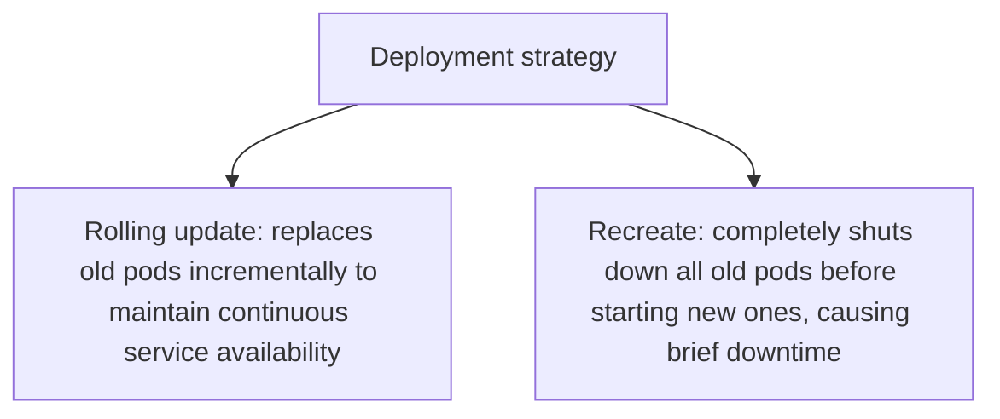


### Self-healing

| Event | Handled by | Action |
|---|---|---|
| Container crash | kubelet | Restarts the container inside the same pod. |
| Pod deletion | Controller manager / scheduler | Deploys a new pod onto a healthy node. |
| Node failure | Controller manager | Reschedules all affected pods onto other available nodes. |
| App version update | Deployment | Creates a new ReplicaSet and manages its rollout. |

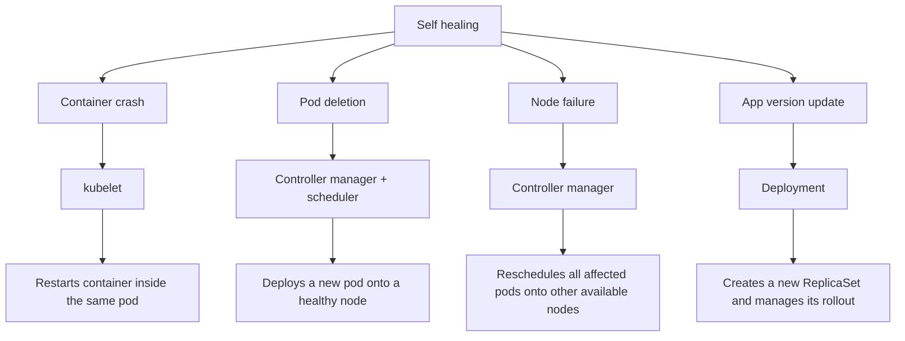


---

## Day 5: Kubernetes Services, Networking

### The problem

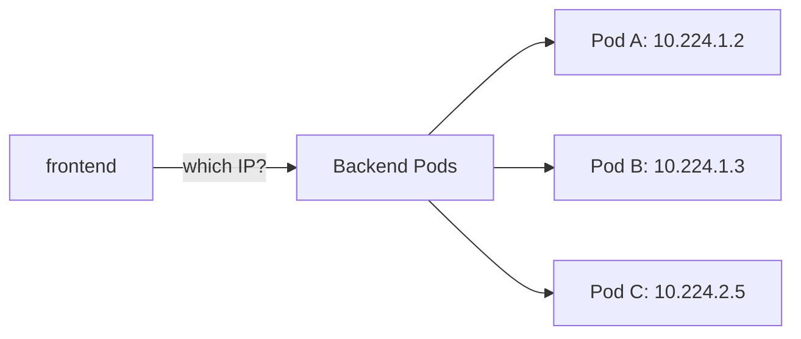

Backend pods A, B, and C each have their own IP:

- Pod A -> 10.224.1.2
- Pod B -> 10.224.1.3
- Pod C -> 10.224.2.5

- The frontend is pointing at "Backend Pods", which are really three separate pods, each with its own IP.
- The question is: which IP does the frontend call?
- Pod IPs are ephemeral. If a pod crashes, gets rescheduled, or is replaced during a deployment, it comes back with a new IP.
- So the frontend can't hardcode these addresses.

### Pod networking

Pods communicate using the pod IP:

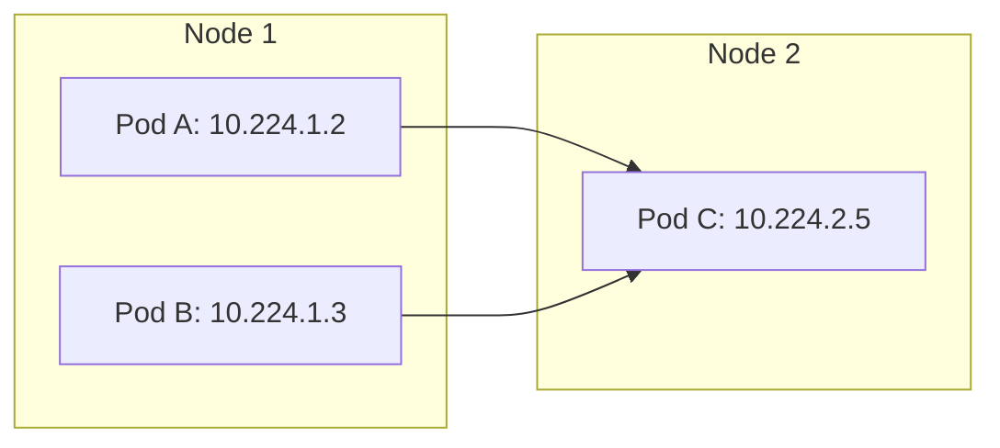

Containers in the same pod communicate via `localhost`:

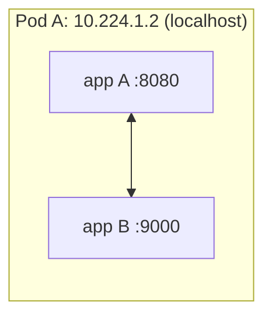

### Service

```
frontend -> service -> backend pods (A, B, C)
```

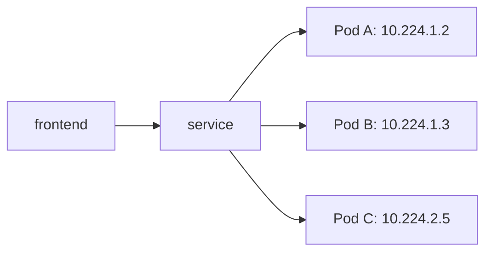


```bash
kubectl get pods -o wide
# NAME                                  READY   STATUS    RESTARTS   AGE     IP           NODE
# backend-deployment-6f5f998878-5t4kk   1/1     Running   0          6m25s   10.244.2.5   multi-node-cluster-worker
# backend-deployment-6f5f998878-ch7zc   1/1     Running   0          6m25s   10.244.2.4   multi-node-cluster-worker
# backend-deployment-6f5f998878-trshc   1/1     Running   0          6m25s   10.244.1.3   multi-node-cluster-worker2

kubectl apply -f service/backend-service.yaml

kubectl get endpointslices
# NAME                   ADDRESSTYPE   PORTS   ENDPOINTS                          AGE
# backend-service-cqr42  IPv4          8080    10.244.2.4,10.244.2.5,10.244.1.3   5m43s
# kubernetes             IPv4          6443    172.21.0.3                         24h
```

- A Service gives a group of pods one stable network identity (a fixed IP and DNS name), so clients don't need to know which individual pods exist or what their IPs are.
- Pods are temporary. When they crash, scale, or get replaced, their IPs change. A Service sits in front of them and stays constant while the pods behind it come and go.
- You create a Service with a label selector.
- Kubernetes continuously finds all ready pods matching that label and records their IPs in an EndpointSlice.
- Kubernetes runs its own DNS server inside the cluster (CoreDNS), and it automatically creates DNS records for every Service.
- DNS name format: `<service-name>.<namespace>.svc.<cluster-domain>`

### Service types

- ClusterIP
- NodePort
- LoadBalancer
- ExternalName

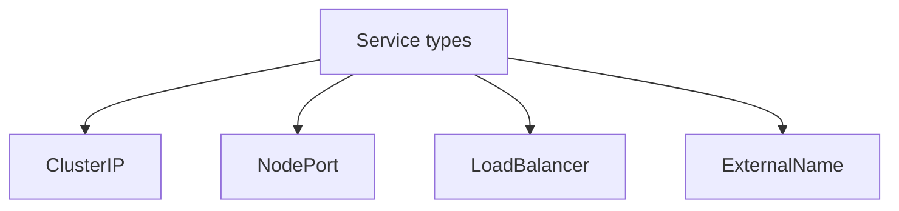


---

## Day 6: ConfigMap, Secrets

- ConfigMaps and Secrets both inject configuration into pods so you don't bake settings into the container image.
- A ConfigMap is for non-sensitive data, and a Secret is for sensitive data.


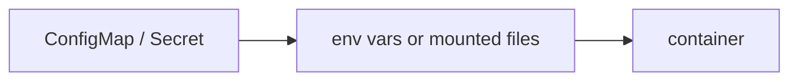

- **ConfigMap**: stores key-value pairs or whole files (plain text, not encrypted).
- **Secret**: same idea, but values are base64-encoded (encoded, not encrypted).

---

## Day 7: Storage & Volumes

*(heading only so far)*